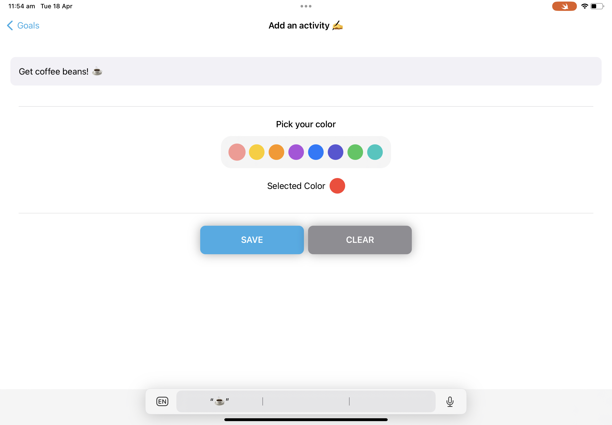

# onelist
An elegant to do list app that is minimal and easy to use.

## What does it do?

With a lot of the to do list apps out there, some of them can be overwhelming to use so "Onelist" aims to solve that.

It is designed to be easy to use and stay out of the way.

## Features

- Clean and simple goal tracker
- No ads
- No tracking
- All data is stored locally (100% open source)

## screenshots

It works on iPad and iPhone and for techies, this was built 100% using Swift Playgrounds!

### iPhone

Note: These are outdated for iPhone, this will change in final release.

  

### iPad

 
 
 
